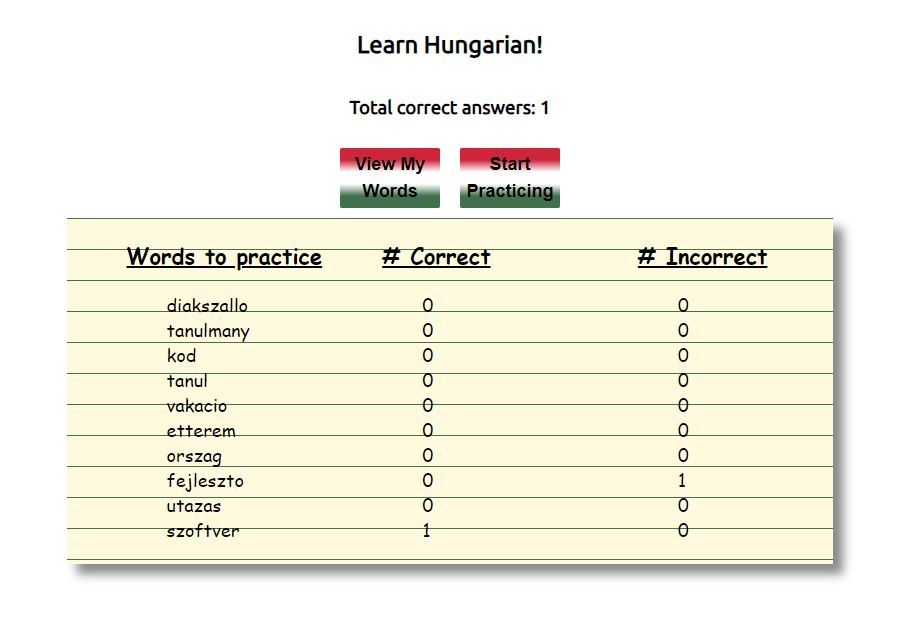
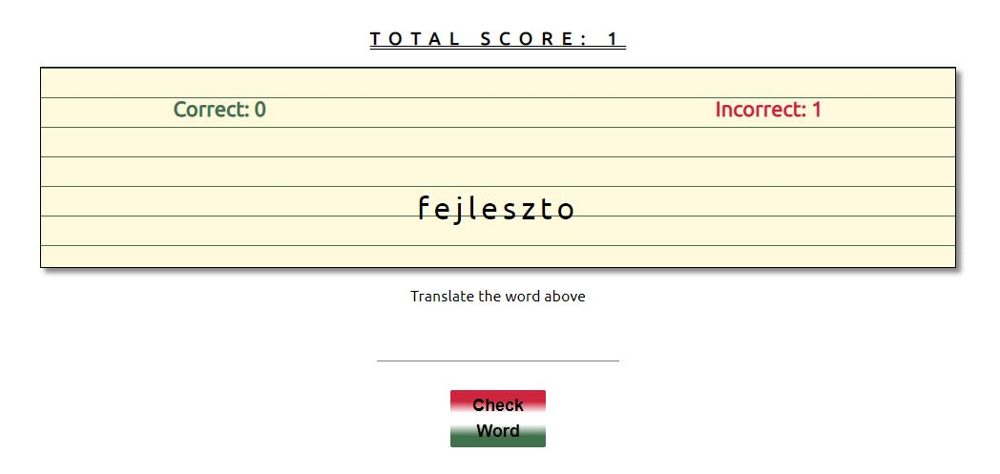
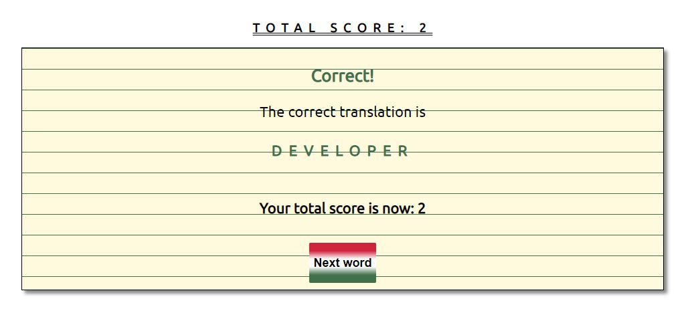
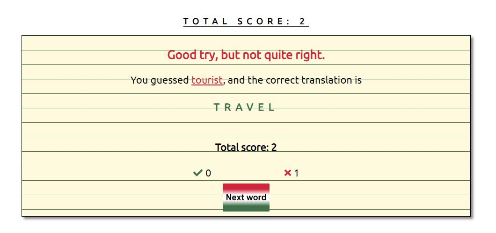

# Spaced box

Spaced repetition is a learning technique that incorporates increasing intervals of time between subsequent review of previously learned material in order to exploit the psychological spacing effect.

Users of Spaced box can practice Hungarian using the spaced repetition technique. Words that are guessed incorrectly will be displayed to the user more frequently so they can learn Hungarian more effectively.

## See it live!

[Spaced Box App](https://spacedbox.now.sh/)

[Spaced Box Server (GitHub)](https://github.com/WEB818/stephen-wendy-spaced-repetition-api)

## Technology Used

Front-End: _ReactJS | CSS_

Back-End: _NodeJS | KnexJS | ExpressJS | PostgreSQL_

Testing: _Cypress_
